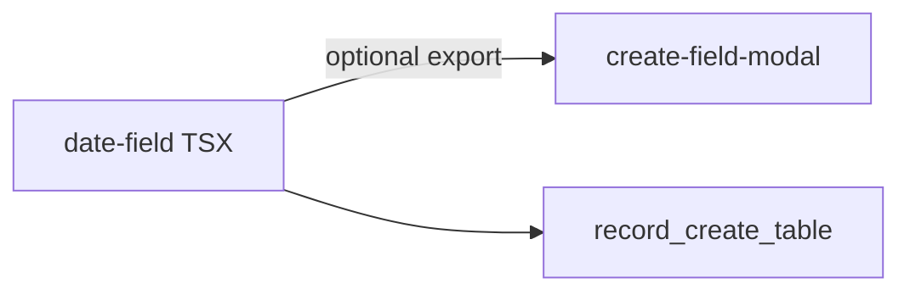

# Calendar: today ring + strict date range (object settings)

## Clarifications locked in

- **Today:** Always show as a **circular ring** (outline) for the current day in the default, non-picked state, matching the new design. Selection/highlight behavior stays **unchanged** for the actually selected value (no redesign of the selected day beyond what Twigs already does).
- **Range rule (object settings, Specific date range):** **Strict** — **To must be strictly after From** (same calendar day is **not** allowed). The toast copy should state clearly that the **start must be before the end** (wording is fine in English: e.g. “The start date must be before the end date.”).

## 1) Calendar wrapper CSS (no new files; colocate in each screen)

**Constraint (product):** Do **not** add a new file for styles. Keep Stitches `css` objects as **file-local** `const` in each place that wraps Twigs `Calendar` / `CalendarRange` (same pattern you already use for `PAST_ONLY_CALENDAR_CONTAINER_CSS`).

**Approach:** In each file that needs the behavior, define (or extend) a single top-level const, e.g. `CALENDAR_WRAPPER_CSS`, that encodes:

- **Today, default:** **Circular ring** — `borderRadius: "50%"`, `aspectRatio: 1`, size/padding as needed, outline-style border using Twigs tokens, neutral fill for “today, not selected”.
- **Past-only:** Reuse/merge the existing rules in the same object: disabled cells + **today** when the day is unavailable, so there is one wrapper `css` per file (e.g. `isPastDateRestriction ? PAST_... : TODAY_...` or one merged object with both selector blocks).

**Target files to touch** (at minimum):

- [`applications/sparrow-crm/features/contacts/components/record/attributes-details/attributes-types/date.tsx`](applications/sparrow-crm/features/contacts/components/record/attributes-details/attributes-types/date.tsx)
- [`applications/sparrow-crm/features/contacts/components/create-contact/date.tsx`](applications/sparrow-crm/features/contacts/components/create-contact/date.tsx)
- [`applications/sparrow-crm/features/table/components/row-cell/date-cell.tsx`](applications/sparrow-crm/features/table/components/row-cell/date-cell.tsx)
- [`applications/sparrow-crm/features/object-settings/components/configurations/fields/date-field.tsx`](applications/sparrow-crm/features/object-settings/components/configurations/fields/date-field.tsx)

Wrapping pattern stays: outer `Box` with `css={...}` + inner `Calendar` with `containerCSS={{ border: "none" }}` (as today). Copy the **same** today-circle + optional past-only rules into each file so the UI matches; a one-line comment (“aligned with other Twigs date pickers”) is enough—**no** shared `*.ts` for CSS.

**Broader “all calendar selection”:** Add the same **file-local** wrapper to every **Twigs** `Calendar` / `CalendarRange` used for CRM date picking, at minimum: filters — [`selected-filter.tsx`](applications/sparrow-crm/features/contacts/components/filter/selected-filter.tsx) and [`custom-dropdown.tsx`](applications/sparrow-crm/features/contacts/components/filter/custom-dropdown.tsx). `CalendarRange` may show two “today” cells; the same `aria-label` / `Today` cell-targeting pattern applies.

**Out of scope unless you want parity:** The separate stack under [`common/components/custom-calendar/`](applications/sparrow-crm/common/components/custom-calendar/) does **not** use Twigs’ `Calendar`; it would need a separate, small `Day`/`calendar-day` style pass. Call this out in implementation notes if meeting/booking must match.

## 2) Full coverage: all date selection conditions (verify for implementation + QA)

Implementation and QA should explicitly cover the **product matrix** so no branch is missed. Constants: [`DATE_ALLOW_OPTIONS`](applications/sparrow-crm/features/object-settings/constants/index.ts) (`anyDate` | `futureOnly` | `pastOnly` | `specificRange`); runtime rules: [`validation.ts` (FIELD_TYPES.DATE)](applications/sparrow-crm/features/contacts/components/record/attributes-details/attributes-types/validation.ts).

| Restriction | Calendar `minValue` / `maxValue` / `isDateUnavailable` | Today ring (circle outline) | Notes |
|-------------|--------------------------------------------------------|----------------------------|--------|
| **anyDate** | Unbounded; weekends per `allowWeekdaysOnly` | Show today ring | Baseline. |
| **futureOnly** | `minValue` = today; block dates before today | Show today ring | Align with validation: not before today. |
| **pastOnly** | `maxValue` = **yesterday**; today **unavailable**; weekend rules if on | **Special** today cell: ring + disabled styling (existing past-only block) | Today is never selectable. |
| **specificRange** (runtime) | `minValue` / `maxValue` from `fromDate` / `toDate` | Show today ring when today is in range | [validation](applications/sparrow-crm/features/contacts/components/record/attributes-details/attributes-types/validation.ts) — value must be within configured bounds. |
| **+ allowWeekdaysOnly** | `isDateUnavailable` Sat/Sun (0/6) on top of row above | Same as parent restriction | [validation](applications/sparrow-crm/features/contacts/components/record/attributes-details/attributes-types/validation.ts) (`mustBeAWeekday`). |

**Object settings** [`date-field.tsx`](applications/sparrow-crm/features/object-settings/components/configurations/fields/date-field.tsx) — every path:

- **Allow = each of the four** options: **Custom date** `Calendar` uses `getCalendarMinValue` / `getCalendarMaxValue` / `isDateUnavailable` correctly (past-only today, weekdays, future, specific bounds).
- **Specific date range:** **From/To** admin (strict + min/max) and stored `fromDate`/`toDate` as **inclusive** runtime limits for end users (admin enforces a valid span; [validation](applications/sparrow-crm/features/contacts/components/record/attributes-details/attributes-types/validation.ts) stays the source of truth for saved values).

**Data entry surfaces** — record [`date.tsx`](applications/sparrow-crm/features/contacts/components/record/attributes-details/attributes-types/date.tsx), create contact [`date.tsx`](applications/sparrow-crm/features/contacts/components/create-contact/date.tsx), table [`date-cell.tsx`](applications/sparrow-crm/features/table/components/row-cell/date-cell.tsx): for **each** restriction, confirm min/max, unavailable, and CSS branch (`pastOnly` vs default).

**Filters** — [`selected-filter.tsx`](applications/sparrow-crm/features/contacts/components/filter/selected-filter.tsx), [`custom-dropdown.tsx`](applications/sparrow-crm/features/contacts/components/filter/custom-dropdown.tsx): no field `validation`; **today ring** for parity. Range filter: no admin From/To rule.

**Regression:** Editing one path (e.g. `pastOnly` today) must not break **selected** / **hover** / **disabled** for the other `DATE_ALLOW_OPTIONS` combinations.

## 3) Strict From / To in [`date-field.tsx`](applications/sparrow-crm/features/object-settings/components/configurations/fields/date-field.tsx)

**Constraints (prevents most bad states):**

- **From** calendar: when `to` is set, set `maxValue` to **`to` minus one day** (strict range so From cannot equal To).
- **To** calendar: when `from` is set, set `minValue` to **`from` plus one day**.

Use `@internationalized/date`’s `CalendarDate` **`.add` / `.subtract`** on parsed values (not string math), consistent with the rest of the file (`parseDate` is already in use).

**Toast (belt + suspenders):** In the `onChange` handlers for From and To, if a selection is still **invalid** (e.g. corrupted edit state or future API data), do **not** call `setDateFieldDetails`; call `toast` from `@sparrowengg/twigs-react` (same as [`general-setting.tsx`](applications/sparrow-crm/features/object-settings/components/configurations/general/general-setting.tsx)) with `variant: "error"` and an **I18n** string.

**i18n:** Add a key under the existing `settings.objectSettings` (or `common`) namespace in the English translation file(s) the project uses for `sparrow-crm` (e.g. [`translation/input/sparrowcrm/en/...`](applications/sparrow-crm/translation/)).

**Do not** add extra state machines: two `onChange` checks + `min`/`max` is enough.

## 4) Save / disabled state in [`create-field-modal.tsx`](applications/sparrow-crm/features/object-settings/components/configurations/fields/create-field-modal.tsx)

- Extend [`handleError`](applications/sparrow-crm/features/object-settings/components/configurations/fields/create-field-modal.tsx) for `FIELD_TYPES.DATE` when `dateFieldDetails.allow?.value === SPECIFIC_DATE_RANGE`:
  - **Require** `from` and `to` when that restriction is active (if product already expects both; align with how the payload is sent).
  - **Require** `dayjs(to).startOf("day") > dayjs(from).startOf("day")` (strictly after, not same day).

Avoid new files for this: either **export** a small `isValidStrictSpecificDateRange(from, to)` from [`date-field.tsx`](applications/sparrow-crm/features/object-settings/components/configurations/fields/date-field.tsx) and **import** it in [`create-field-modal.tsx`](applications/sparrow-crm/features/object-settings/components/configurations/fields/create-field-modal.tsx), or keep a **2–3 line** `dayjs` comparison in both files with a one-line comment to keep them in sync—prefer a single export from the existing `date-field` module to stay DRY without a new file.

**Optional:** Show the same I18n message in the create-button `Tooltip` when the range is invalid, so the user is not only blocked with a disabled button—only if a short tooltip is easy; otherwise `handleError` + disabled is enough and toast covers interaction-time feedback.

## 5) Quality bar

- **Type safety:** Prefer narrow types for `dateFieldDetails` in new helpers (no new `any` in new code paths).
- **A11y:** No removal of `aria-label` on triggers; toasts are supplementary.
- **Test manually:** Twigs `Calendar` for From/To with strict min/max, past-only + today ring, and filter `CalendarRange`.

Per-file `CALENDAR_..._CSS` lives next to its `Box`+`Calendar`; not extracted to a new module.
