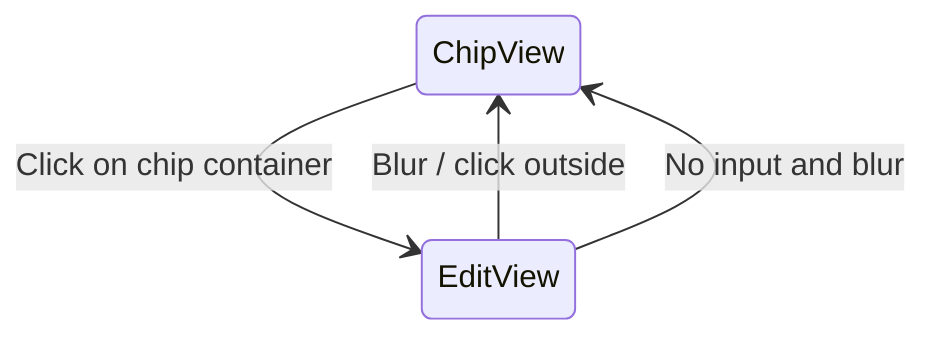

# Email Chip Toggle Field

## Problem

The current implementation tries to mix chips and a textarea inline, creating an awkward double-input feel. The user wants two visually identical containers that toggle based on focus:

- **Edit mode (focused)**: A standard `Textarea` showing comma-separated emails.
- **Chip mode (blurred)**: A chip container showing validated email pills with close buttons.

## Approach

Both views share the **same outer dimensions** and sit in the same position. A single `isEditMode` boolean state controls which one is visible.



## Key file

- `[add-user-modal.tsx](applications/sparrow-crm/features/account-settings/components/user-permission/add-user-modal.tsx)` -- all changes are in this single file.

## Shared constants for both views

```typescript
const EMAIL_FIELD_CSS = {
  minHeight: "$30",
  maxHeight: "$40",
  overflowY: "auto",
  borderRadius: "$lg",
  background: "$neutral50",
  padding: "$4",
};
```

Both containers will use this base CSS plus a dynamic border (normal vs error).

## State changes

- Add `isEditMode: boolean` state (default `true` when no chips exist, `false` when chips exist).
- Keep existing: `emailInput`, `emailChips`, `emailError`.

## Edit mode (Textarea)

- Standard `Textarea` with the shared CSS dimensions.
- Shows comma-separated raw email text.
- On **blur**: tokenize input into chips, validate each, switch to chip mode (`isEditMode = false`), set `emailInput = ""`.
- On **Enter/comma/Tab**: same tokenize+chip behavior (already exists).
- On **paste** with separators: same tokenize behavior (already exists).

## Chip mode (chip container)

- A `Flex` container with the same shared CSS dimensions.
- Renders each `EmailChipItem` as a pill:
  - Valid chips: neutral background (`$neutral50`, border `$neutral200`).
  - Invalid chips: error background (`$negative100`, border `$negative300`, color `$negative600`).
  - Each chip uses `TruncatedTextWithTooltip` with `maxWidth="160px"` for text truncation.
  - Each chip has a close `IconButton` to remove it.
- Placeholder text shown when no chips exist.
- On **click anywhere** in the chip container: convert chips back to comma-separated string in `emailInput`, switch to edit mode (`isEditMode = true`), auto-focus the textarea.

## Transition logic

- **Blur (edit -> chip)**: `tokenizeEmails(emailInput)` -> `createEmailChipItems()` -> `setEmailChips(prev + new)` -> `setEmailInput("")` -> `setIsEditMode(false)`.
- **Click chip container (chip -> edit)**: `setEmailInput(emailChips.map(c => c.value).join(", "))` -> `setEmailChips([])` -> `setIsEditMode(true)` -> focus textarea via ref.
- **Initial state**: If no chips and no input, show textarea (edit mode) with placeholder.

## Chip removal (while in chip mode)

- The close icon on each chip removes it from `emailChips` via `handleRemoveEmailChip`.
- Does NOT switch to edit mode (stays in chip view).
- If all chips are removed, auto-switch to edit mode.

## Error display

- The `emailError` string is shown below the active container using a `Text` with `$negative600` color (consistent with Twigs form error pattern), or via the `Textarea` `error` prop when in edit mode.

## Validation on send

- `handleSendInvitations` stays mostly the same.
- If in edit mode with pending input, tokenize first then validate.
- If in chip mode, validate existing chips directly.
