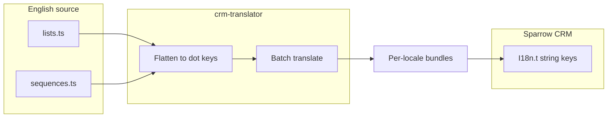

# Plan: Remove unused `lists` / `sequences` translation keys safely

## How keys map to runtime strings

Per [architecture.md](applications/sparrow-crm/translation/docs/architecture.md), the pipeline prefixes **filename** as the namespace and **dot-flattens** nested objects. So:

- File [`lists.ts`](applications/sparrow-crm/translation/input/sparrowcrm/en/lists.ts) → keys like `lists.shareList`, `lists.listInfoCard.description`, `lists.ariaLabels.shareList`.
- File [`sequences.ts`](applications/sparrow-crm/translation/input/sparrowcrm/en/sequences.ts) → keys like `sequences.tabs.active`, `sequences.toast.failedToCreateSequence`.

The app resolves these via **`I18n.t("namespace.full.path")`** (see e.g. [sequence-list.tsx](applications/sparrow-crm/features/sequences/components/sequence-list/sequence-list.tsx), [list-sidebar.tsx](applications/sparrow-crm/common/components/sidebar/list-sidebar.tsx)). There is no strict TypeScript key type in [i18n/setup.ts](applications/sparrow-crm/i18n/setup.ts), so **runtime breaks only if a removed key is still referenced**.

## Step 1: Build an authoritative list of keys to audit

- Walk the object tree in `lists` and `sequences` and produce **every** full path: top-level keys, and nested keys joined with `.` (same as pipeline: `listInfoCard.learnMore` under namespace `lists` → `lists.listInfoCard.learnMore`).
- **Do not** guess from English text; derive paths only from the current object shape so nothing is missed (especially large nested sections in `sequences.ts` such as `ariaLabels`, `emptyState`, `editor`, etc.).

Optional but reliable: reuse the same parsing/flatten approach as [translation `script/index.js` / `parser.js`](applications/sparrow-crm/translation/script/) (the pipeline already flattens for TSV), or a small one-off script that imports the objects and uses `flat` the same way—keeps the key list consistent with production.

## Step 2: Prove each key is unused (whole repo, not only `features/lists`)

For **each** full key `lists.*` and `sequences.*`:

1. **Primary search (exact string):** Use fixed-string search for the full path, e.g. `lists.ariaLabels.selectListByName`, in:
   - All of [`crm-client`](.) — `**/*.{ts,tsx,js,jsx}` at minimum; include `md` only if you document keys there (current grep shows **no** `lists.` / `sequences.` in markdown).
   - **Hotspots** (highest volume today):
     - [`applications/sparrow-crm/features/sequences/constants/index.ts`](applications/sparrow-crm/features/sequences/constants/index.ts) (many `sequences.*` lookups)
     - [`applications/sparrow-crm/features/sequences/`](applications/sparrow-crm/features/sequences/) (components, helpers)
     - [`applications/sparrow-crm/features/lists/`](applications/sparrow-crm/features/lists/) and [`applications/sparrow-crm/common/components/sidebar/list-sidebar.tsx`](applications/sparrow-crm/common/components/sidebar/list-sidebar.tsx)

2. **Count matches outside the source definition file:** When searching, the key string will always appear inside [`lists.ts`](applications/sparrow-crm/translation/input/sparrowcrm/en/lists.ts) or [`sequences.ts`](applications/sparrow-crm/translation/input/sparrowcrm/en/sequences.ts) as the object key. A key is **safe to remove** only if the **only** occurrences are in that definition (or in generated/docs you explicitly exclude). Any match in application code = **keep the key**.

3. **Avoid false positives on similar keys:** Prefer searching the **full path** (e.g. `lists.lists` vs a longer key starting with the same characters). If two keys share a prefix, verify the longer path explicitly (fixed-string `rg -F` helps).

4. **Dynamic / split keys (sanity check):** Quick repo-wide search for patterns like `` `lists.${` ``, `` `sequences.${` ``, or `"lists." +` in TS/TSX. Current codebase shows **no** such patterns for these namespaces; if any appear in the future, those keys need **manual** usage review, not only literal grep.

5. **Cross-namespace:** Some UI might use a different namespace for the same idea (e.g. list add-record success under `common` in one place). That does **not** make `lists.*` unused if nothing references `lists.*`; it only means you should not assume semantic duplicates across files.

## Step 3: Remove only verified-dead keys

- Delete entries only from the audit list in step 2 with **zero** non-definition references.
- Preserve object structure: removing a whole nested object is fine; removing a single leaf leaves valid TS.
- Keep comments in the source files if they document behavior; [project.mdc](applications/sparrow-crm/translation/.cursor/rules/project.mdc) notes comments are stripped before parse—removing **only** a comment does not remove a key from the bundle.

## Step 4: Regenerate translations and verify build

- From [`applications/sparrow-crm/translation/`](applications/sparrow-crm/translation/), run `npm run translate` (or your CI-equivalent) so `output/<lang>/lists.ts` and `sequences.ts` stay aligned with English source per [README](applications/sparrow-crm/translation/README.md). `output/` is gitignored but required for deploy/S3 flow.
- Run the app’s usual **typecheck / lint / test** command for `sparrow-crm` so any accidental reference breakage is caught (unlikely if step 2 was strict).

## Step 5: Manual smoke check (optional but high value)

- Lists: list page, create/duplicate list, sidebar, add-record flows that still call `lists.*`.
- Sequences: list, editor, settings tabs, toasts, and any flow covered by `sequences.constants` helpers.

## Risk summary

| Risk                      | Mitigation                                                             |
| ------------------------- | ---------------------------------------------------------------------- |
| Missed reference          | Full-path grep across whole repo; treat partial key overlap carefully. |
| Dynamic key construction  | Confirmed absent for `lists`/`sequences`; re-check if code changes.    |
| Wrong nested path         | Build key list from object shape (step 1), not by hand from memory.    |
| Stale non-English bundles | Run translation pipeline after English edits.                          |

## Deliverable

- Updated [`lists.ts`](applications/sparrow-crm/translation/input/sparrowcrm/en/lists.ts) and [`sequences.ts`](applications/sparrow-crm/translation/input/sparrowcrm/en/sequences.ts) with only unused keys removed, plus regenerated translation output and green CI for the sparrow-crm app.
