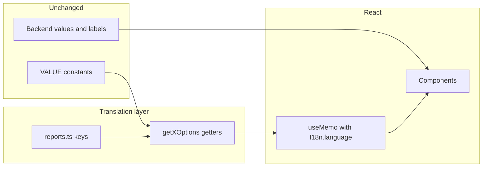

# Reports module translation plan

## Preconditions and constraints

- **Do not translate**: API enum `value`s (e.g. `EMAIL_SHARING_VALUES`, `DASHBOARD_RANGE_FILTER_VALUES`, `KPI_*_VALUES`), [`DASHBOARD_MODAL_TITLE`](applications/sparrow-crm/features/reports/constants/index.ts) codes, [`ATTRIBUTE_ROLE_VALUES`](applications/sparrow-crm/features/reports/constants/index.ts), [`KPI_API_KEYS`](applications/sparrow-crm/features/reports/constants/widget.tsx), object/attribute names from the backend, and **chart type display names** in [`CHART_TYPE_OPTIONS`](applications/sparrow-crm/features/reports/constants/index.ts) (keep current English `label` strings exactly as-is).
- **Do translate**: All user-facing literals today (option `label` / `description`, static UI copy, toasts, page titles where they are user-visible, and **every `aria-label` / `ariaLabel`**). For aria strings that embed backend `displayName`, use i18next placeholders (e.g. `Select sort column {{name}}`) so the **English sentence** matches today; only the fixed prefix is translated, `name` stays the raw API string.
- **Constants pattern**: Keep existing `*_VALUES` / type unions / arrays of API values in [`constants/index.ts`](applications/sparrow-crm/features/reports/constants/index.ts), [`constants/sidebar.ts`](applications/sparrow-crm/features/reports/constants/sidebar.ts), [`constants/widget.tsx`](applications/sparrow-crm/features/reports/constants/widget.tsx). Move **human-readable** `label` / `description` (and grouped section labels like `IMAGE` / `DATA`) into [`translation/input/sparrowcrm/en/reports.ts`](applications/sparrow-crm/translation/input/sparrowcrm/en/reports.ts) and assemble options in **getter functions** that call `I18n.t("reports…")` (and `common…` when reusing).
- **Consumer pattern**: In React components, follow the same dependency as profile dropdown: `useMemo(() => getX(), [I18n.language])` from [`@i18n/setup`](applications/sparrow-crm/i18n/setup.ts). Use **SNAKE_CASE** names for the memoized arrays/objects (e.g. `EMAIL_SHARING_OPTIONS = useMemo(() => getEmailSharingOptions(), [I18n.language])`).
- **API for strings**: In `features/reports`, use **`I18n.t(...)` only** from [`@i18n/setup`](applications/sparrow-crm/i18n/setup.ts): no `useTranslation`, no `const { t } = I18n` / no destructured `t`—spell **`I18n.t("reports…")`** / **`I18n.t("common…")`** at each call site so rerenders still follow `I18n.language` when combined with `useMemo(..., [I18n.language])` for derived lists.
- **Reuse [`common`](applications/sparrow-crm/translation/input/sparrowcrm/en/common.ts)**: Where the English string is identical and the key is appropriate, use `I18n.t("common.none")`, `I18n.t("common.customize")`, `I18n.t("common.moreOptions")`, etc. Add keys under `reports` only when there is no suitable `common` entry.
- **Pipeline rules**: Translation source uses `export const reports = { ... }` in **`reports.ts`** (filename matches export per [input-files.mdc](applications/sparrow-crm/translation/.cursor/rules/input-files.mdc)); **camelCase** keys; nesting encouraged.
- **Smart routing**: Reports feature does not reference smart-router strings. Use [`routing`](applications/sparrow-crm/translation/input/sparrowcrm/en/routing.ts) only as a **reference** for aria/title patterns; no report-specific work unless you want cross-module dedup later.

## i18n key flow: `reports` namespace only

- Keep **[`reports.ts`](applications/sparrow-crm/translation/input/sparrowcrm/en/reports.ts)** and **`export const reports`**; barrel stays `export { reports } from "./reports"` in [`en/index.ts`](applications/sparrow-crm/translation/input/sparrowcrm/en/index.ts).
- With `nsSeparator: "."` in [`i18n/setup.ts`](applications/sparrow-crm/i18n/setup.ts), the first path segment is the **namespace**. All report strings must use **`I18n.t("reports.<rest>")`** (e.g. `I18n.t("reports.reports")` for the word “Reports”, `I18n.t("reports.dashboard.createDashboard")` for nested keys—exact tree is implementation detail as long as every call uses the `reports.` prefix).
- **Migrate existing UI** that currently uses `t("report.*")` / `I18n.t("report.*")` (including any `useTranslation` + `t("report.*")`) to **`I18n.t("reports.*")`** so keys resolve against the `reports` bundle.

## Structured keys in `reports.ts`

Suggested nesting (exact English values copied from code; keys are camelCase under `export const reports`):

- `reports.dashboard` — page chrome, empty/error toasts (e.g. [`report-dashboard.tsx`](applications/sparrow-crm/features/reports/pages/report-dashboard.tsx) “Dashboard not found”, Helmet “Reports” if treated as user-visible).
- `reports.constants.emailSharing`, `emailFrequency`, `attachmentFormat`, `chartCreation`, `dashboardRange` — mirror each option’s current `label` / `description` / group labels (`IMAGE`, `DATA`, `PNGs`, etc.) **except** chart-type block (excluded per your note).
- `reports.constants.sidebar` — legend, KPI sort/delta, line interpolation/style, bar stack, conversion drop-off, color palette labels (exact strings from [`sidebar.ts`](applications/sparrow-crm/features/reports/constants/sidebar.ts)).
- `reports.constants.widget` — setup/customize tabs, limit top/bottom, axis label map ([`AXIS_LABELS`](applications/sparrow-crm/features/reports/constants/widget.tsx)), pivot frequency, compare-by previous period labels.
- `reports.aria` — one key per distinct aria string (static and templates with `{{name}}` / `{{axisLabel}}` where needed). Covers the large set in chart-creation, grid layout, dashboard selection, etc.
- `reports.copy` (or per-area sub-objects) — remaining UI strings not in constants (e.g. [`chart-preview/index.tsx`](applications/sparrow-crm/features/reports/components/chart-creation/chart-preview/index.tsx) validation copy, modal titles that are literals).

Keep **`CHART_TYPE_OPTIONS`** labels out of `reports.ts` entirely.

## Getter module(s)

Add e.g. [`features/reports/constants/getters.ts`](applications/sparrow-crm/features/reports/constants/getters.ts) (or split `getters/dashboard.ts`, `getters/sidebar.ts`, `getters/widget.ts`).

- Each `get*` function imports **only** value enums/icons from existing constant files, calls `I18n.t("reports…")` / `I18n.t("common…")`, and returns arrays/objects **identical in shape** to today’s exports (same `value` fields, same `icon` / `backgroundColor` references).
- **Do not** change sort order, filtering logic, or which options exist—only the source of `label` / `description` / section `label`.

Examples of getters (non-exhaustive):

- `getEmailSharingOptions`, `getEmailFrequencyOptions`, `getAttachmentFormatOptionsGrouped`, `getChartCreationOptions`, `getDashboardRangeFilterOptions`
- From sidebar: `getLegendPositionOptions`, `getKpiChartSortByOptions`, `getKpiChartDeltaIndicatorOptions`, `getLineInterpolationOptions`, `getLineStyleOptions`, `getBarChartStackTypeOptions`, `getConversionDropOffPercentageOptions`, `getColorPaletteOptions`
- From widget: `getWidgetCreationSidebarTabsOptions`, `getLimitOptionsOptions`, `getAxisLabels`, `getPivotColumnFrequencyOptions`, `getCompareByPreviousValuesOptions`

Remove exported **label-bearing** static arrays from the three constant files once getters exist (prefer single source of truth).

## Component updates (module-by-module pass)

Work through [`features/reports/`](applications/sparrow-crm/features/reports) in slices:

1. **Constants consumers** — replace static `*_OPTIONS` usage with `useMemo` + getter; keep `*_VALUES` imports unchanged.
2. **Pages** — hardcoded `aria-label` / copy → `I18n.t("reports.…")` / `I18n.t("common.…")`.
3. **Top bar / modals / sharing**, **chart creation**, **grid / widgets / charts / AI report**, **skeletons** (if they have user-visible or aria text).

**Remove `useTranslation` from all files under `features/reports`** (e.g. [`report-options.tsx`](applications/sparrow-crm/features/reports/components/report-top-bar/report-options.tsx), [`public/index.tsx`](applications/sparrow-crm/features/reports/components/public/index.tsx)): import `I18n` from `@i18n/setup` and call **`I18n.t(...)` at use sites** (no destructured `t` from `useTranslation`).

## Audit checklist (before merge)

- Grep for `t("report.` / `I18n.t("report.` — should be **zero**; only `I18n.t("reports.` / `I18n.t("common.` (and no `useTranslation` in `features/reports`).
- Grep `features/reports` for remaining hardcoded `aria-label=` / `ariaLabel=` (except intentional backend-only fragments).
- Grep for string `label:` / `description:` in report `constants/` after refactor.
- Confirm **`CHART_TYPE_OPTIONS`** labels unchanged character-for-character.
- Confirm no translation applied to backend **keys** / **ids** / **modal title constants** used as API discriminators.
- Spot-check English vs pre-change strings.
- Language-switch smoke test when `I18n.language` changes.

