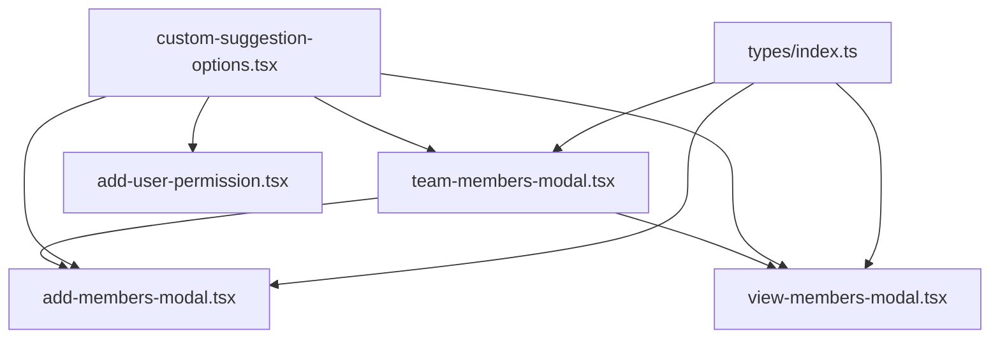

# Simplify custom-suggestion-options to pure UI component

## Current state (5 files)

- `custom-suggestion-options.tsx` — Contains `SuggestionOption` type, `EmptyMembers`, `CustomOption`, `CustomSuggestionSelect` (with debounce, duplicate checking, search conversion)
- `team-members-modal.tsx` — Shell + `MemberOption`, `mapUserToOption`, `searchUsers`, `useDefaultUserOptions`, `DEFAULT_USERS_LIMIT`
- `add-members-modal.tsx` / `view-members-modal.tsx` — Content components
- `add-user-permission.tsx` — Imports `CustomOption`

## Target state (4 files + types)

### 1. `types/index.ts` — Add types

Add `MemberOption` and `SuggestionOption` to the existing [types/index.ts](applications/sparrow-crm/features/account-settings/types/index.ts) (which already has `User`, `Team`, etc.):

```typescript
export type MemberOption = {
  value: string;
  label: string;
  profilePicUrl: string;
  email: string;
  id?: string;
};

export type SuggestionOption = {
  value: string;
  label: string;
  profilePicUrl?: string;
  email?: string;
  id?: string;
  isDisabled?: boolean;
};
```

### 2. `custom-suggestion-options.tsx` — Pure UI component (slimmed down)

**Keep only:**

- `SEARCH_MORE_FOOTER_VALUE` constant (needed for footer option rendering inside `CustomOption`)
- `CustomOption` component (also used by `add-user-permission.tsx`)
- `CustomSuggestionSelect` — the Select wrapper with:
  - Props: `defaultOptions`, `searchFunction`, `placeholder`, `onChange`, `onInputChange`, `inputValue`, `onInputValueChange`
  - UI features: focus/blur icon swap, scroll styles, debounce timing
  - `onChange` just calls the parent callback directly — **no duplicate checking, no toast**

**Remove:**

- `SuggestionOption` type (moved to types file, imported)
- `EmptyMembers` component (moved to team-members-modal)
- `selectedValues` and `duplicateWarning` props (duplicate checking moves to parent onChange handlers)

### 3. `team-members-modal.tsx` — Central logic hub

**Add back:**

- `EmptyMembers` component (moved from custom-suggestion-options)

**Keep (already there):**

- `DEFAULT_USERS_LIMIT`, `mapUserToOption`, `searchUsers`, `useDefaultUserOptions`
- Shell component passing `defaultOptions` and `searchFunction` as props to children

**Import changes:**

- `MemberOption`, `SuggestionOption` from `../../types`
- `SEARCH_MORE_FOOTER_VALUE` from `./custom-suggestion-options`

### 4. `add-members-modal.tsx` — Update imports + add duplicate checking

- Import `MemberOption`, `SuggestionOption` from `../../types` (no more import from team-members-modal)
- Import `EmptyMembers` from `./team-members-modal` (circular dep is runtime-safe since it is only used inside render)
- Import `CustomSuggestionSelect` from `./custom-suggestion-options`
- Move duplicate checking into the `onChange` handler inline:

```typescript
onChange={(newValue) => {
  const alreadySelected = newValue.some((m: any) =>
    selectedMembersToAdd.some((e) => e.value === m.value)
  );
  if (alreadySelected) {
    toast({ variant: "warning", title: "Member already selected", description: "..." });
    return;
  }
  setSelectedMembersToAdd((prev) => [...(prev || []), ...newValue]);
}}
```

### 5. `view-members-modal.tsx` — Same import updates + inline duplicate checking

Same pattern as add-members-modal.

### 6. `add-user-permission.tsx` — No change needed

Already imports `CustomOption` from `./custom-suggestion-options` — stays the same.

## Dependency flow



No circular runtime dependencies for values — `add-members-modal` and `view-members-modal` import `EmptyMembers` from `team-members-modal`, but it is only used inside render functions (never at module initialization time), which is safe with modern bundlers.
