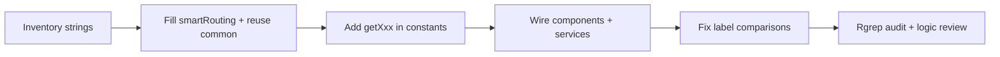

# Smart routing translation implementation

## Reference implementation (learn from existing modules)

- **Sequences pattern** (`[features/sequences/constants/index.ts](applications/sparrow-crm/features/sequences/constants/index.ts)`): stable `SCREAMING_SNAKE` / string **values** stay in plain objects; user-visible strings come from `**getXxx()` functions** that call `I18n.t("sequences....")`. Components assign `**const FOO = useMemo(() => getFoo(), [I18n.language]);`** (see e.g. `[sequence-settings/notifications.tsx](applications/sparrow-crm/features/sequences/components/sequence-settings/notifications.tsx)`).
- **Contacts pattern** (`[features/contacts/helpers/filter/display-helpers.ts](applications/sparrow-crm/features/contacts/helpers/filter/display-helpers.ts)`): `**get` accessors on records when a map must stay a single export but labels must react to language.
- **Meetings pattern** (`[features/meeting/constants/index.ts](applications/sparrow-crm/features/meeting/constants/index.ts)`): `**getObjectTypeLabelMap()`-style factories for maps built from `I18n.t`.
- **i18n namespace**: English sources live under `[translation/input/sparrowcrm/en/](applications/sparrow-crm/translation/input/sparrowcrm/en/)`; the export name must match the filename (`[input-files.mdc](applications/sparrow-crm/translation/.cursor/rules/input-files.mdc)`). Code uses `**I18n.t("smartRouting....")`** matching `**export const smartRouting = { ... }\*\*`in`[smart-routing.ts](applications/sparrow-crm/translation/input/sparrowcrm/en/smart-routing.ts)`. `[index.ts](applications/sparrow-crm/translation/input/sparrowcrm/en/index.ts)`already re-exports`smartRouting`—no barrel changes needed unless you split files (not required).

## Step 1–3: `common` (and others) reuse vs new keys

- Build a checklist of every **distinct English UI string** currently hardcoded under `[features/smart-routing/](applications/sparrow-crm/features/smart-routing)` (constants + components + services + helpers that surface copy in toasts/errors).
- For each string, search `[translation/input/sparrowcrm/en/common.ts](applications/sparrow-crm/translation/input/sparrowcrm/en/common.ts)` and other namespaces (`contacts`, `automations`, `meetings`, etc.).
- **3a**: If there is an entry whose **value is identical** (including casing and punctuation), use that key (e.g. `common.customize` for `"Customize"`, `automations.trigger` for `"Trigger"`, `common.choose` for `"Choose"`, `common.delete` for `"Delete"`, `meetings.completed` / `tasks.completed` where the value is exactly `"Completed"`—pick the module that matches **character-for-character**).
- **3b**: Otherwise add a **camelCase** key under `smartRouting`, preferably grouped (e.g. `toast`, `errors`, `placeholders`, `ariaLabels`, `workflowNodes`, `routingRule`, `logs`, `formPreview`, `filters`, `appearance`, `nodes`, `shareModal`, `codeSnippet`, `aiEnrichment`).

**Examples already identified as “reuse” candidates** (verify exact value before wiring):

| Current copy          | Likely existing key                             |
| --------------------- | ----------------------------------------------- |
| Customize             | `common.customize`                              |
| Trigger               | `automations.trigger`                           |
| Choose                | `common.choose`                                 |
| Delete                | `common.delete`                                 |
| Completed (runs chip) | e.g. `meetings.completed` (confirm exact match) |

**Examples likely needing `smartRouting`** (no exact duplicate found in a quick pass): `"Smart Router created successfully"`, `"Something went wrong"` (differs from `contacts.createRecord.somethingWentWrong` / `common.errors.*` punctuation), `"Routing Rule"`, `"Owner Assignment Form"`, edge labels `"Matched"` / `"Not Matched"`, most form-builder / filter operator phrasing.

## Step 4–6: Constants, getters, and `useMemo`

**Constants files with user-visible strings** (non-exhaustive; grep-driven audit required):

- `[constants/workflow-nodes.ts](applications/sparrow-crm/features/smart-routing/constants/workflow-nodes.ts)` — node **labels**
- `[constants/tabs.ts](applications/sparrow-crm/features/smart-routing/constants/tabs.ts)`, `[smart-route-data.ts](applications/sparrow-crm/features/smart-routing/constants/smart-route-data.ts)`, `[smart-router-logs.ts](applications/sparrow-crm/features/smart-routing/constants/smart-router-logs.ts)`
- `[routing-rule-config-ui.ts](applications/sparrow-crm/features/smart-routing/constants/routing-rule-config-ui.ts)`
- `[filters-operators.ts](applications/sparrow-crm/features/smart-routing/constants/filters-operators.ts)` (large)
- `[form-preview.ts](applications/sparrow-crm/features/smart-routing/constants/form-preview.ts)`, `[appearance.ts](applications/sparrow-crm/features/smart-routing/constants/appearance.ts)`, `[data-field-catalog.ts](applications/sparrow-crm/features/smart-routing/constants/data-field-catalog.ts)`, `[default-props.ts](applications/sparrow-crm/features/smart-routing/constants/default-props.ts)`, `[assignment-option-values.ts](applications/sparrow-crm/features/smart-routing/constants/assignment-option-values.ts)`, `[components-list.ts](applications/sparrow-crm/features/smart-routing/constants/components-list.ts)`, `[code-snippet.ts](applications/sparrow-crm/features/smart-routing/constants/code-snippet.ts)`, plus any other constant with `label` / `title` / `placeholder` / `description` shown in UI.

**Approach**:

1. Keep **machine values** (`value`, `nodeType`, enums, API slugs) **unchanged** in `as const` objects.
2. Move **display strings** into `**getSmartRouteTypes()`**, `**getSmartRouterStatusLabels()`**, `**getFormSetupTabs()**`, `**getWorkflowNodeTypeDefinitions()**`(or smaller focused getters),`**getDateFilterOptions()**`, `**getRoutingRuleConfigUi()**`, `\*\*getFilterOperatorTree()\*\*`, etc., each using `I18n.t` / shared keys.
3. Every component/helper that **currently imports** a constant **only for UI labels** should switch to `**useMemo(() => getter(), [I18n.language])`** in React components, or call the getter from a parent and pass props down. For **non-React modules** (e.g. `[helpers/reconstruction.ts](applications/sparrow-crm/features/smart-routing/helpers/reconstruction.ts)` setting `data.label` for branches, `[services/*.ts](applications/sparrow-crm/features/smart-routing/services/)` toasts), calling `I18n.t` directly is acceptable **if i18n is initialized before those run (same as other feature services).

**Naming**: follow sequences—`**getPascalCase` functions** in the relevant `constants/*.ts` (or a dedicated `constants/i18n/*.ts` if you need to avoid circular imports), and **UPPER_SNAKE locals in components for memoized results.

## Critical behavior preservation (not “business logic” but required for i18n)

Today several places **compare translated-looking `label` strings** to constants, e.g. `[create-header.tsx](applications/sparrow-crm/features/smart-routing/components/create-smart-route/create-header.tsx)` `status.label === smartRouterStatus.LIVE.label` and the same pattern in `[smart-route-list-cells.tsx](applications/sparrow-crm/features/smart-routing/components/smart-route-list/smart-route-list-cells.tsx)`. After i18n, those comparisons **must use stable ids** (`value` / `statusKey` / enum), not `label`. Same idea anywhere `option.label` is used for branching.

## Step 7–9: Scope of string replacement

- Replace **all user-visible** strings: headings, buttons, placeholders, tooltips, `aria-label`, empty states, table headers, validation messages shown in UI, **toast `title`/`description`**, inline errors.
- **Do not translate**: API field names, slugs, `data-testid`, enum **values** sent to/received from backend, user/content from API (`attribute.label`, `user.name`, etc.).
- **Default props / stored form defaults** (`[default-props.ts](applications/sparrow-crm/features/smart-routing/constants/default-props.ts)`): confirm whether those labels are **persisted** unchanged; if persisted defaults must stay locale-agnostic for API compatibility, restrict translation to **editor-only** presentation without changing stored payloads (minimal structural change, not business rules).

## Step 10–12: Audits

1. **Hardcoded text**: run ripgrep over `features/smart-routing` for JSX/prop string literals and toast/error strings; spot-check `title="`, `description:`, `placeholder=`, `aria-label=`, `Helmet` titles (`[pages/index.tsx](applications/sparrow-crm/features/smart-routing/pages/index.tsx)`, `[pages/create-smart-route.tsx](applications/sparrow-crm/features/smart-routing/pages/create-smart-route.tsx)`).
2. **Logic diff review**: ensure only (a) copy → `I18n.t`, (b) getters + `useMemo`, (c) label→value comparisons, (d) imports of `I18n`—no query keys, conditions, or API payloads altered.
3. **Procedure checklist**: re-verify common reuse table, `useMemo` on every constant-derived UI import path, and no backend-sourced string translation.

## Execution order (recommended)

This is a **large surface** (~90+ TSX files under smart-routing); expect the bulk of effort in **filters-operators**, **form preview/appearance**, **assignment drawers**, and **shared list/header** patterns.
