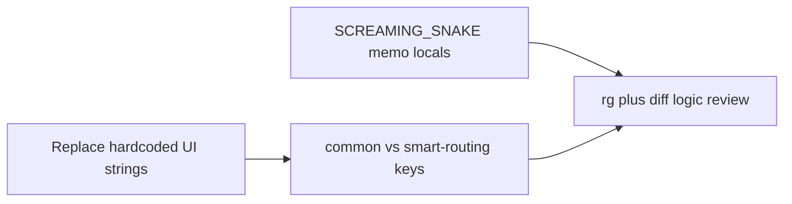

# Smart routing: naming alignment, translation coverage, and audits

## Reference convention (source of truth)

Across [meetings](applications/sparrow-crm/features/meeting/components/meeting-info/meeting-record-modal.tsx) and [sequences](applications/sparrow-crm/features/sequences/components/sequence-editor/nodes/task/priority-selection.tsx):

- **Getters**: `camelCase` — e.g. `getPriorityOptionsPills()`, `getFormSetupTabs()`.
- **Memoized UI bundles from getters**: `**const SCREAMING_SNAKE = useMemo(() => getX(), [I18n.language])` (or `useMemo` with extra logic, same deps).
- **Stable ids / machine values**: imported constants with **SCREAMING_SNAKE** keys (already true for `[formSetupTabs](applications/sparrow-crm/features/smart-routing/constants/tabs.ts)`, `[appearanceSettings](applications/sparrow-crm/features/smart-routing/constants/appearance.ts)`, `[SHARE_ROUTER_MODAL_OPTION_IDS](applications/sparrow-crm/features/smart-routing/constants/share-router-modal.ts)`).
- Getter **return objects** for translated strings should keep **SCREAMING_SNAKE** property names (e.g. `getRoutingRuleConfigUi()` → `HEADER_TITLE`, …) — this part is largely done; the **local variable names** holding those objects still need alignment.

## 1) Naming: rename memoized locals to SCREAMING_SNAKE (no behavior change)

Mechanical renames at use sites (update every reference in the same file):

| Current (camelCase)                                                                                                                                                                                                  | Target (align with sequences/meetings)                                     |
| -------------------------------------------------------------------------------------------------------------------------------------------------------------------------------------------------------------------- | -------------------------------------------------------------------------- |
| `routingRuleConfigUi`                                                                                                                                                                                                | `ROUTING_RULE_CONFIG_UI`                                                   |
| `formSetupTabsUi`                                                                                                                                                                                                    | `FORM_SETUP_TABS_UI`                                                       |
| `appearanceSettingsUi` (and hook return field)                                                                                                                                                                       | `APPEARANCE_SETTINGS_UI`                                                   |
| `inputSizeOptions` / `buttonSizeOptions` in `useAppearanceUiConstants`                                                                                                                                               | `INPUT_SIZE_OPTIONS` / `BUTTON_SIZE_OPTIONS`                               |
| `shareOptions`                                                                                                                                                                                                       | `SHARE_OPTIONS`                                                            |
| `comparatorOptionsUi`, `comparatorConstantsUi`, `comparatorUi` (routing-rule-filter, re-tagging-filter)                                                                                                              | e.g. `COMPARATOR_OPTIONS_UI`, `COMPARATOR_CONSTANTS_UI`, `COMPARATOR_UI`   |
| `previewSectionsUi`                                                                                                                                                                                                  | `PREVIEW_SECTIONS_UI`                                                      |
| `dateFilterOptions` (both assignment-analytics-chart files)                                                                                                                                                          | `DATE_FILTER_OPTIONS`                                                      |
| `dataCollectionOptions` (create-modal)                                                                                                                                                                               | `DATA_COLLECTION_OPTIONS`                                                  |
| `edgeLabels` / `assignmentEdgeLabels` in `[workflow-node-creation.tsx](applications/sparrow-crm/features/smart-routing/components/create-smart-route/assignment/assignment-node-popover/workflow-node-creation.tsx)` | `EDGE_LABELS` / `ASSIGNMENT_GRAPH_EDGE_LABELS` (or single consistent name) |

**Hook `[useAppearanceUiConstants](applications/sparrow-crm/features/smart-routing/components/create-smart-route/form-setup/sidebar/appearance-accordions.tsx)`**: return `{ APPEARANCE_SETTINGS_UI, INPUT_SIZE_OPTIONS, BUTTON_SIZE_OPTIONS }` and update all destructuring/callers in that file (and any re-exported types if present).

`**getAssignmentGraphEdgeLabels()` in non-React helpers** (e.g. `createConditionEdges`): renaming locals to `EDGE_LABELS` is enough for style; if language switching must refresh edge labels reliably, prefer **passing memoized labels from a component/effect that depends on `[I18n.language]` rather than introducing new business logic—only wire labels where the graph is already rebuilt on locale change.

## 2) Unnecessary / redundant changes (translation-only scope)

When reviewing the branch diff (or continuing work):

- **Drop** unused imports and dead variables introduced during i18n passes (Biome/ESLint on touched files).
- **Avoid** expanding scope: e.g. dev-only sample copy in `[component-serialization](applications/sparrow-crm/features/smart-routing/utils/component-serialization.ts)` — keep English unless it is user-visible in product.
- **Do not refactor** duplicate chart components unless required for identical strings; keep both files i18n-consistent only.
- **Do not add** new wrapper hooks/components solely for i18n if a single `useMemo` + `I18n.t` already matches neighbors.

## 3) Remaining hardcoded UI strings (priority order)

Grep already shows many literals; prioritize:

1. **Drawers**: `[redirect-config.tsx](applications/sparrow-crm/features/smart-routing/components/create-smart-route/assignment/node-drawer/configs/redirect-config.tsx)`, `[fallback-config.tsx](applications/sparrow-crm/features/smart-routing/components/create-smart-route/assignment/node-drawer/configs/fallback-config.tsx)`, `[calendar-assignment-config.tsx](applications/sparrow-crm/features/smart-routing/components/create-smart-route/assignment/node-drawer/configs/calendar-assignment-config.tsx)`, `[owner-assignment-config.tsx](applications/sparrow-crm/features/smart-routing/components/create-smart-route/assignment/node-drawer/configs/owner-assignment-config.tsx)` — titles, placeholders, aria-labels, primary actions (`Save`), section copy.
2. **Shared / filters**: `[routing-rule-filter.tsx](applications/sparrow-crm/features/smart-routing/components/create-smart-route/assignment/node-drawer/shared/routing-rule-filter.tsx)`, re-tagging/conditions aria strings, `[form-setup/sidebar/index.tsx](applications/sparrow-crm/features/smart-routing/components/create-smart-route/form-setup/sidebar/index.tsx)` sidebar aria.
3. **Nodes / logs / form** (second sweep): `assignment/nodes/`, runs toolbar/table, `[data-field-config.tsx](applications/sparrow-crm/features/smart-routing/components/create-smart-route/form-setup/sidebar/component-configurations/data-field-config.tsx)`, appearance/editor tools, smart-routing pages — as needed.

**Keys**: Prefer `[common.ts](applications/sparrow-crm/translation/input/sparrowcrm/en/common.ts)` only when English matches **exactly**; otherwise extend `[smart-routing.ts](applications/sparrow-crm/translation/input/sparrowcrm/en/smart-routing.ts)` (nested sections already exist: `redirectConfig`, `fallbackConfig`, `nodes`, `toast`, etc.). Reuse existing keys where the English already matches (e.g. nodes titles like “Redirect To”).

## 4) Logic-change prevention (audit checklist)

**Forbidden** (unless fixing broken i18n comparisons):

- API payloads, query keys, Redux defaults, route paths, stable node/type ids.

**Allowed**:

- Replacing **label** equality checks with **value / status key** comparisons.
- **Correctness-only** fixes already called out (e.g. passing `.value` into helpers that expect string ids) — document as non-feature in PR notes.

**Verification**:

- `rg` in `features/smart-routing` for risky patterns: `=== "…"` on user-visible strings, `option.label ===`, `smartRouterStatus.*\.label` comparisons.
- Second pass: `git diff` limited to smart-routing + `smart-routing.ts` translation input for any non-string / non-rename change.

## 5) Comprehensive audit (final)

1. **Translation**: `rg` for JSX string props (`title="`, `placeholder="`, `aria-label="`, visible English in children) under `[features/smart-routing](applications/sparrow-crm/features/smart-routing)`.
2. **Naming**: all `useMemo(() => get…` bindings use **SCREAMING_SNAKE** `const` names; getters stay `getCamelCase`.
3. **Logic**: confirm no accidental condition changes; list intentional `.value` / id-comparison fixes.

