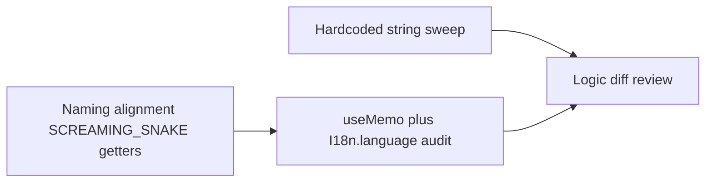

# Smart routing translation: review, naming alignment, and coverage

## Reference convention (source of truth)

In [sequences/constants/index.ts](applications/sparrow-crm/features/sequences/constants/index.ts) and [notes/constants/index.ts](applications/sparrow-crm/features/notes/constants/index.ts):

- **Stable machine values** live in `export const FOO = { BAR: "value", ... }` with **SCREAMING_SNAKE** keys.
- **Getters** are `getXxx()` / `getXxxValues()` and return objects whose **translated-string properties use SCREAMING_SNAKE keys**, e.g. `getSequencesSteps()` returns `{ EDITOR, SETTINGS, ANALYTICS }` (see [sequence-top-bar.tsx](applications/sparrow-crm/features/sequences/components/sequence-creation/sequence-top-bar.tsx) — `sequencesSteps.EDITOR`).
- Components typically do `**const x = useMemo(() => getXxx(), [I18n.language]);`** (sequences sometimes uses `[]` on `getSequencesSteps`; your rule prefers `**[I18n.language]\*\` for translated getters—keep that for smart-routing).

The previous pass introduced **camelCase** keys on `[getRoutingRuleConfigUi()](applications/sparrow-crm/features/smart-routing/constants/routing-rule-config-ui.ts)` (`headerTitle`, `saveLabel`, …) and **camelCase** on `[SHARE_ROUTER_MODAL_OPTION_IDS](applications/sparrow-crm/features/smart-routing/constants/share-router-modal.ts)` (`embed`, `publicLink`) and on `[getAssignmentGraphEdgeLabels()](applications/sparrow-crm/features/smart-routing/constants/assignment-graph-layout.ts)` (`matched`, `notMatched`). **These should be aligned** to match the sequences pattern: **SCREAMING_SNAKE property names** on getter outputs and option id maps (e.g. `HEADER_TITLE`, `SAVE_LABEL`; `EMBED`, `PUBLIC_LINK`; `MATCHED`, `NOT_MATCHED`), then update all consumers accordingly.

---

## 1) Unnecessary / redundant changes (translation-only scope)

**Review and trim (no behavior change):**

- **Imports**: Remove unused imports introduced during i18n work (e.g. biome “unused import” on touched files).
- **Non-UI sample data**: [component-serialization.ts](applications/sparrow-crm/features/smart-routing/utils/component-serialization.ts) `createSampleFormStructure()` — if this is dev/test-only, either keep English **or** use `I18n.t` only if the sample is ever shown; avoid expanding scope beyond user-visible UI unless product requires it.
- **Duplication**: Two near-duplicate chart files (`[.../smart-router-logs/assignment-analytics-chart.tsx](applications/sparrow-crm/features/smart-routing/components/create-smart-route/smart-router-logs/assignment-analytics-chart.tsx)` vs `[.../analytics/assignment-analytics-chart.tsx](applications/sparrow-crm/features/smart-routing/components/create-smart-route/smart-router-logs/analytics/assignment-analytics-chart.tsx)`) — **do not refactor** unless asked; only ensure both stay i18n-consistent.

**Do not revert** small fixes that are **correctness for existing bugs** (not “business logic”): e.g. passing `smartRouteTypes.MEETING_FORM.value` into `getSetupStepLabel` and comparing `dataCollection` with `smartRouteTypes.API.value` in [create-header.tsx](applications/sparrow-crm/features/smart-routing/components/create-smart-route/create-header.tsx) — document these in the logic audit as “type/value correctness,” not feature changes.

---

## 2) Naming convention alignment (required)

| Area                            | Current                           | Target                                                                      |
| ------------------------------- | --------------------------------- | --------------------------------------------------------------------------- |
| `getRoutingRuleConfigUi`        | camelCase keys                    | `HEADER_TITLE`, `RETAGGING_TITLE`, … (match prior naming + sequences style) |
| `SHARE_ROUTER_MODAL_OPTION_IDS` | `embed` / `publicLink`            | `EMBED` / `PUBLIC_LINK`                                                     |
| `getAssignmentGraphEdgeLabels`  | `matched` / `notMatched`          | `MATCHED` / `NOT_MATCHED`                                                   |
| Component usage                 | `routingRuleConfigUi.headerTitle` | `routingRuleConfigUi.HEADER_TITLE` (after getter returns SCREAMING_SNAKE)   |

**Files to touch:** [routing-rule-config-ui.ts](applications/sparrow-crm/features/smart-routing/constants/routing-rule-config-ui.ts), [share-router-modal.ts](applications/sparrow-crm/features/smart-routing/constants/share-router-modal.ts), [assignment-graph-layout.ts](applications/sparrow-crm/features/smart-routing/constants/assignment-graph-layout.ts), [share-router-modal.tsx](applications/sparrow-crm/features/smart-routing/components/common/share-router-modal.tsx), routing-rule config components, [workflow-node-creation.tsx](applications/sparrow-crm/features/smart-routing/components/create-smart-route/assignment/assignment-node-popover/workflow-node-creation.tsx).

**useMemo audit:** For every `getXxx()` used for **labels/options**, ensure `**useMemo(() => getXxx(), [I18n.language])` (or equivalent) at the import site; grep for `getRoutingRuleConfigUi`, `getFormSetupTabs`, `getComparatorOptions`, `getDateFilterOptions`, `getAppearanceSettings`, etc., and fix any missing `I18n.language` dependency.

---

## 3) Remaining hardcoded UI text (high-impact areas)

A quick scan shows many files still matching `title|placeholder|aria-label|description="..."` patterns. Prioritize in this order:

1. **Assignment drawers** — [owner-assignment-config.tsx](applications/sparrow-crm/features/smart-routing/components/create-smart-route/assignment/node-drawer/configs/owner-assignment-config.tsx), [calendar-assignment-config.tsx](applications/sparrow-crm/features/smart-routing/components/create-smart-route/assignment/node-drawer/configs/calendar-assignment-config.tsx), [fallback-config.tsx](applications/sparrow-crm/features/smart-routing/components/create-smart-route/assignment/node-drawer/configs/fallback-config.tsx), [redirect-config.tsx](applications/sparrow-crm/features/smart-routing/components/create-smart-route/assignment/node-drawer/configs/redirect-config.tsx).
2. **Routing rule filter / shared** — [routing-rule-filter.tsx](applications/sparrow-crm/features/smart-routing/components/create-smart-route/assignment/node-drawer/shared/routing-rule-filter.tsx), [node-config-header.tsx](applications/sparrow-crm/features/smart-routing/components/create-smart-route/assignment/node-drawer/shared/node-config-header.tsx), [members-weightage-modal.tsx](applications/sparrow-crm/features/smart-routing/components/create-smart-route/assignment/node-drawer/shared/members-weightage-modal.tsx).
3. **Graph nodes** — files under `[assignment/nodes/](applications/sparrow-crm/features/smart-routing/components/create-smart-route/assignment/nodes/)` (titles, aria-labels, tooltips).
4. **Logs / runs** — [runs-toolbar.tsx](applications/sparrow-crm/features/smart-routing/components/create-smart-route/smart-router-logs/runs/runs-toolbar.tsx), [runs-table.tsx](applications/sparrow-crm/features/smart-routing/components/create-smart-route/smart-router-logs/runs/runs-table.tsx), sidebars.
5. **Form setup** — [data-field-config.tsx](applications/sparrow-crm/features/smart-routing/components/create-smart-route/form-setup/sidebar/component-configurations/data-field-config.tsx), [appearance-accordions.tsx](applications/sparrow-crm/features/smart-routing/components/create-smart-route/form-setup/sidebar/appearance-accordions.tsx) (remaining English labels like “Background Color”), [editor-tools.tsx](applications/sparrow-crm/features/smart-routing/components/create-smart-route/editor-tools.tsx), [pages/index.tsx](applications/sparrow-crm/features/smart-routing/pages/index.tsx).

**Rules for keys:**

- Reuse [common.ts](applications/sparrow-crm/translation/input/sparrowcrm/en/common.ts) only when English matches **exactly** (case and punctuation).
- Otherwise add nested keys under `[smart-routing.ts](applications/sparrow-crm/translation/input/sparrowcrm/en/smart-routing.ts)` (existing structure: `toast`, `routingRule`, `appearance`, `list`, etc.).
- **Do not translate** backend-sourced strings, API enums, `data-testid`, or user/content from API.

---

## 4) Avoid redundant code

- Prefer **one getter** per concern; avoid duplicate `I18n.t` calls for the same string in one render path.
- Do **not** add new abstractions (extra wrapper components/hooks) unless a file already uses that pattern.
- Keep diffs minimal: string → `I18n.t`, getter shape + `useMemo`, or label→value comparison fixes only where i18n broke equality.

---

## 5) Logic-change prevention (audit checklist)

**Forbidden (unless explicitly fixing i18n breakage):**

- Changing API payloads, query keys, Redux shape, route paths, or default `dataCollection` / node types.
- Changing conditions that compared **stable ids** (already fixed in places like list status chips).

**Allowed:**

- Replacing **label string comparisons** with **value / status key** comparisons (translation-safe).
- Fixing **obvious type bugs** (e.g. passing object instead of `.value` to functions expecting a string)—document as non-feature.

**Verification commands (after edits):**

- `rg` for `smartRouterStatus.*\\.label` / `option\\.label ===` / `=== \".*\"` in smart-routing (spot-check).
- Diff review: only translation-related files + intentional key renames above.

---

## 6) Comprehensive audit (translation + logic)

1. **Translation coverage:** `rg` over `[features/smart-routing](applications/sparrow-crm/features/smart-routing)` for JSX/prop literals: `>[^<{]*[A-Za-z]{3,}`, `title="`, `placeholder="`, `aria-label="`, `description: "` in toasts, `Helmet` titles in pages.
2. **Getter + memo:** Grep `get[A-Z]` imports and confirm `useMemo(..., [I18n.language])` where UI derives from getters.
3. **Naming:** Getter return objects use **SCREAMING_SNAKE** keys; stable ids use existing `FOO.BAR` constant style.
4. **Logic:** Second pass on git diff or file list restricted to smart-routing + `smart-routing.ts` for any non-string changes.

---

## Suggested execution order

1. Revert getter/constant **property naming** to SCREAMING_SNAKE (routing rule UI, share modal ids, edge labels) and fix consumers—small, mechanical, restores consistency with sequences.
2. Run **memo dependency** grep-fix pass.
3. **Batch translate** remaining drawers → nodes → logs → form heavy files.
4. Final **rg audit** + **logic diff** review.
